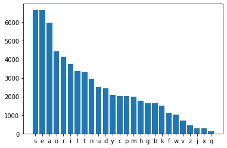

This post will derive an optimal Wordle-specific guessing strategy. The approach taken will be reducing the set of possible words a maximum amount for each guess; however, it doesn't make sense to keep reducing the set of words until the final guess, so we're reintroduced to our old friend, the [explore-exploit tradeoff](https://conceptually.org/concepts/explore-or-exploit).

The first question we need to answer is, given 6 guesses, how many should be exploring which consonants and vowels are and aren't present, and how many should exploit that knowledge to guess the word? These two options aren't completely exclusive, but a common problem I see in my own family, is exploring after only the first word and getting stuck in a rut of limited guesses.

This can be interpreted as an optimization problem: How many guesses maximize the exploration and exploitation value? Meaning, how many guesses should explore the possible letter combinations and how many should use that to guess the word.

Taking inspiration from the [Secretary Problem](https://wikipedia.org/wiki/Secretary_problem), let's "reject" the first `$\frac{N}{e}$` choices and "accept" the next best. Meaning, let's not consider the first `$\frac{6}{e} \approx 2$` guesses toward our exploitation and then try guessing afterwards.

Another option is to maximize the gradient (<abbr title="Machine Learning">ML</abbr> people get hyped) over word-set size as the exploitation strategy. This would mean that you'd stop exploring letters after each following step stops reducing the set size as much.

This is hand-wavy because I mostly want to dive into the <abbr title="Computer Science">CS</abbr>, but even this can be calculated… I'll maybe do that as well. Instead, I'll see when the letter frequencies plateau and conclude that guessing letters past that point just offer diminishing returns.

Here's the list of all [wordle words](data/wordles.txt) as of writing this, though I doubt it'll change much. It might be helpful to have in case you want to run your own tests or follow along.

<details>

<summary>Code? Ew Cringe!</summary>

We'll begin by importing commonly-used packages since it should be highly accessible for anyone. `Matplotlib` isn't necessary since I show the image, so if you don't have it installed, don't worry.

```python
from matplotlib import pyplot as plt
from itertools import permutations
```
Now, we just define some helper functions that iterate through the Wordle words and keep track of different patterns.

```python
def letter_distribution(words):
    d = {}
    for word in words:
        for letter in word:
            d[letter] = d.get(letter, 0) + 1
    return d


def letter_placement(words):
    d = {0: {}, 1: {}, 2: {}, 3: {}, 4: {}}
    for word in words:
        for i, letter in enumerate(word):
            d[i][letter] = d[i].get(letter, 0) + 1
    return d


def score_placement(word, letter_places):
    score = 0
    for i, letter in enumerate(word):
        score += letter_places[i][letter]
    return score


def subset_from_letters(word : str, words : set) -> set:
    return set(wordle for wordle in words \
               if set(wordle).issubset(word))
```

Let's open the `wordles.txt` file and make words a set of all the possible five-letter words.

```python
# map's lambda takes the first 5 characters of each line
# in wordles.txt, removing the \n character
words = set(map(lambda x: x[:5], open("wordles.txt", "r")))
```

To begin determining the best starting word(s), we look at the letter frequency.

```python
letter_dist = letter_distribution(words)
dist = sorted(letter_dist.items(), key=lambda x: x[1], reverse=True)

plt.bar([x[0] for x in dist], [y[1] for y in dist])
plt.show()
```



| Letter | Count |
|--------|------:|
| s      |  6665 |
| e      |  6662 |
| a      |  5990 |
| o      |  4438 |
| r      |  4158 |
| i      |  3759 |
| l      |  3371 |
| t      |  3295 |
| n      |  2952 |
| u      |  2511 |
| d      |  2453 |
| y      |  2074 |
| c      |  2028 |
| p      |  2019 |
| m      |  1976 |
| h      |  1760 |
| g      |  1644 |
| b      |  1627 |
| k      |  1505 |
| f      |  1115 |
| w      |  1039 |
| v      |   694 |
| z      |   434 |
| j      |   291 |
| x      |   288 |
| q      |   112 |

Unsurprisingly, the vowels (`e`, `a`, `o`, …, `i`, `u`, `y`?) are highly ranked. What's interesting is that `s` occurs more than `e`. Regardless, let's maximize the letters possible on the first guess and search for which words can be made with "seaor". While we're at it, let's see what the second and third words are following that same strategy.

```python
print(set(word for word in subset_from_letters("seaor", words) \
					if len(set(word)) == 5))

print(set(word for word in subset_from_letters("iltnu", words) \
					if len(set(word)) == 5))

print(set(word for word in subset_from_letters("dycpm", words) \
					if len(set(word)) == 5))
```

> {'aeros', 'arose', 'soare'}
> {'unlit', 'until'}
> {}

Well, we have three choices for the best first word: `aeros`, `arose`, and `soare`. And luckily there are even some second choices: `unlit`, `until`.

What we can do now is compare these options to determine the best. "How will one be better than another with the same letters?" you might ask. Well, we can now consider letter position. This is moving more toward exploitation.

```python
letter_places = letter_placement(words)

first = {'aeros', 'soare', 'arose'}
second = {'unlit', 'until'}

for word in first:
    print(word, score_placement(word, letter_places))

for word in second:
    print(word, score_placement(word, letter_places))
```

| Word  | Score |
|-------|------:|
| aeros |  8219 |
| soare |  7138 |
| arose |  4708 |
|       |       |
| unlit |  2989 |
| until |  2506 |

As we can see, [aeros](https://www.thefreedictionary.com/Aeros) is the best of the three options for our first word. As for our second choice, [unlit](https://www.thefreedictionary.com/unlit) is the better than `until`. All this ranking is doing is seeing if a letter in a certain position is more likely than in a different position.

If you look at the letter distribution graph, you'll see that the frequencies level out around y-m. This indicates that searching past that point won't result in too many additional words.

For the sake of completion, we'll search for the final word. However, now we'll need to switch the lowest value characters around until a new second and third word can be arranged.

```python
exploit_count = 3
letters = ''.join([letter for letter, count in dist[:exploit_count * 5]])

for word in permutations(letters):
    first = set(w for w in subset_from_letters(word[:5], words) \
                if len(set(w)) == 5)
    second = set(w for w in subset_from_letters(word[5:10], words) \
                 if len(set(w)) == 5)
    third = set(w for w in subset_from_letters(word[10:15], words) \
                if len(set(w)) == 5)

    if first and second and third:
        print(first, second, third)
        break
```

> {'soare', 'aeros', 'arose'} {'clint'} {'dumpy'}

</details>

# Solution

From this analysis, here's a table to help make the best starting Wordle guesses.

## All Words

| Exploration | Words |       |       |
|-------------|-------|-------|-------|
| 1           | AEROS |       |       |
| 2           | AEROS | UNLIT |       |
| 3           | AEROS | CLINT | DUMPY |

It was mentioned on a [Hacker News comment](https://news.ycombinator.com/item?id=29928263#29930961) that there are actually two lists: one for guessing and another for possible answers. Using this, I updated the best first couple words. I'll also include these, but deriving it is simple with the code above. I'll pull a physics professor and "leave it as an exercise."

## Solution Words

| Exploration | Words |       |       |
|-------------|-------|-------|-------|
| 1           | ROATE |       |       |
| 2           | ROATE | PULIS |       |
| 3           | ROATE | PULIS | CHYND |

I'm sure there are different approaches to determining the best starting word. Some people like the most vowels (in that case use `AUREI`) while others would prioritize positions (then choose `CARES`). I think knocking out the most potential words would help me the most, so that's why I chose this method.

A benefit of this is that after only two steps of exploitation, you have information about 10 unique letters. Another step will now put you at 15, over half of the alphabet. I hope this comes in handy and you enjoyed the read!
