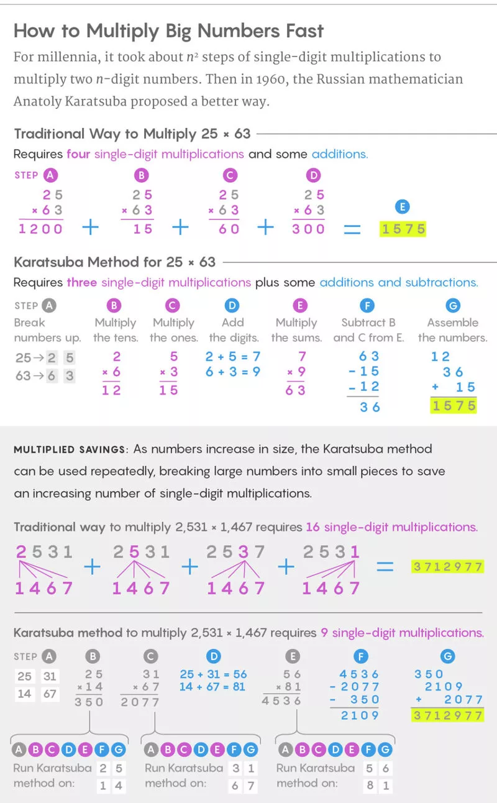

## Running Average

If I have the average of 1 and 2, I can add 3 to that average:

```python
avg = (1 + 2) / 2
avg += (3 - avg) / 3
```

## Swapping

```
$$
a = a + b \\
b = a - b \\
a = a - b \\
$$
```

```c
void swap(int *a, int *b) {
  if (a != b) {
    *a ^= *b;
    *b ^= *a;
    *a ^= *b;
  }
}
```

## Minimum and Maximum

- Minimum:
  - `$min(a,b)=\frac{1}{2}(a+b-|a-b|)$`
- Maximum:
  - `$max(a,b)=\frac{1}{2}(a+b+|a-b|)$`

## Non-Overflowing Average

```c
unsigned avg(unsigned a, unsigned b)
{
    return (a & b) + (a ^ b) / 2;
}
```

<details>

<summary>Comparison</summary>

There are a few common methods of finding an average. This section compares their pros and cons 😊

The organization is first outlining the function in C, then showing the MIPS assembly. The comments on each line of assembly is the cycles required to run that instruction.

```c
unsigned average1(unsigned a, unsigned b)
{
    return (a + b) / 2;
}

// lw      $3,8($fp)  # 5
// lw      $2,12($fp) # 5
// addu    $2,$3,$2   # 4
// srl     $2,$2,1    # 4
```

average1 has the shortest assembly but might overflow.

Cycles: 18

```c
unsigned average2(unsigned low, unsigned high)
{
    return low + (high - low) / 2;
}

// lw      $3,12($fp) # 5
// lw      $2,8($fp)  # 5
// subu    $2,$3,$2   # 4
// srl     $3,$2,1    # 4
// lw      $2,8($fp)  # 5
// addu    $2,$3,$2   # 4
```

average2 takes only 6 instructions to complete, but requires the correct order of arguments. It might be necessary to use a comparison. That would add 16 cycles which brings the total cycles to 43.

Cycles: 27

```c
unsigned average3(unsigned a, unsigned b)
{
    return (a / 2) + (b / 2) + (a & b & 1);
}

// lw      $2,8($fp)  # 5
// srl     $3,$2,1    # 4
// lw      $2,12($fp) # 5
// srl     $2,$2,1    # 4
// addu    $3,$3,$2   # 4
// lw      $4,8($fp)  # 5
// lw      $2,12($fp) # 5
// and     $2,$4,$2   # 4
// andi    $2,$2,0x1  # 3
// addu    $2,$3,$2   # 4
```

Interestingly, this solution performs the same as `average2`'s worst case.

Cycles: 43

```c
unsigned average4(unsigned a, unsigned b)
{
    return (a & b) + (a ^ b) / 2;
}

// lw      $3,8($fp)  # 5
// lw      $2,12($fp) # 5
// and     $3,$3,$2   # 4
// lw      $4,8($fp)  # 5
// lw      $2,12($fp) # 5
// xor     $2,$4,$2   # 4
// srl     $2,$2,1    # 4
// addu    $2,$3,$2   # 4
```

This is the best solution to avoid overflow. It takes twice as many cycles to complete, but minimizes the risk of pesky overflow bugs.

Cycles: 36

</details>

## Sources

1. https://www.maa.org/sites/default/files/0746834259921.di020713.02p0009e.pdf
2. https://devblogs.microsoft.com/oldnewthing/20220207-00/?p=106223
3. https://stackoverflow.com/q/1826159
