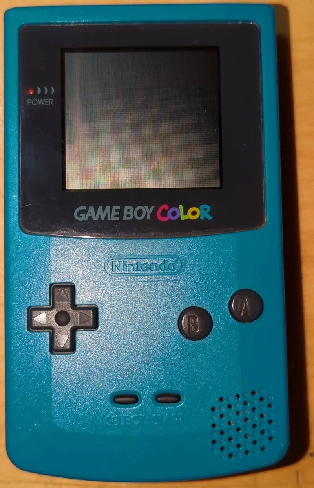
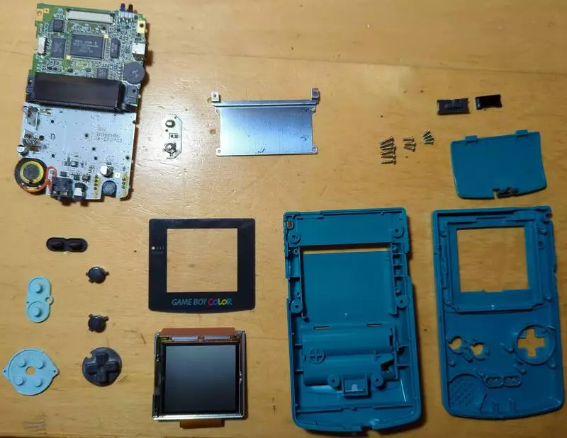
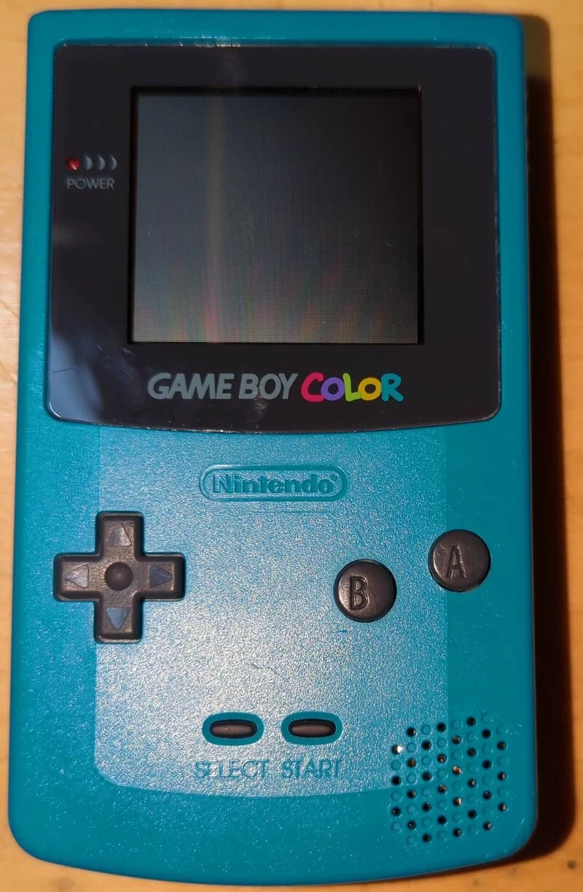

I've been using my old Game Boy Color a lot more now that I'm programming a GB game, so I wanted to clean up the handheld! This tutorial is the culmination of a few YouTube videos from [The Retro Future](https://youtu.be/fZ__K0QotW8) and [Odd Tinkering](https://youtu.be/2BmGMi0IEx4). I liked a lot of their tips, so I decided to add them and my own to this post.

## Tools:

- Tri-Point Y1 Screwdriver
- Phillips Head Screwdriver
- Cotton Swab
- Tooth Brush
- 99% Isopropyl Alcohol
  - The higher percentage, the faster the evaporation
- Vinegar

## Disassembly

1. Unscrew the 4 Tri-Wing screws on the back of the <abbr title="Game Boy Color">GBC</abbr>
   1.5. Unscrew 2 more screws under the batteries
2. Remove the back plate
3. Unscrew the 3 Phillips screws holding the motherboard
4. Disconnect the screen's ribbon cable from the top of the motherboard
5. Lift the motherboard out of the casing
6. Slide the <abbr title="Infrared Radiation">IR</abbr> cover and power switch slider out of the case
7. Remove the buttons and membranes
   - <abbr title="Directional">D</abbr>-pad
   - A + B
   - Start + Select
8. Lift the screen out of the case
   - It comes loose by flexing the chassis back and forth
9. On the back plate, unscrew the 4 Phillips screws holding the cartridge slot
10. Slide the metal battery contact out of the case

## Cleaning

Motherboard:

1. Dip the cotton swabs in isopropyl alcohol
   - If the board is really dirty, use the tooth brush to scrub with the alcohol
2. Clean everything on the motherboard with the swabs
   - Focus on the metal connectors
   - Thoroughly clean all button contacts
3. Clean the surface of the speaker
4. Dab alcohol around the volume dial and power switch
   - Actuate them to spread the alcohol inside
5. Use alcohol to clean the headphone jack
6. Swab the battery terminal with alcohol

Case:

1. Prepare a hot soapy water to submerge the case
2. Wash and brush the plastic in the water
3. Clean the speaker holes
4. Scrub the plastic screen protector

Buttons:

1. Wash the buttons and their rubber membranes in the water
   - Use a toothbrush to clean
2. Also clean the IR cover

Battery Contact:

1.  Let the metal battery contact sit in vinegar until it shines like new

## Reassemble

1. Read the **Disassembly** section backwards 😂
2. Screw in a [sequence](https://www.boltscience.com/pages/tsequence.htm) that evenly distributes the force

## Enjoy

Now that the GBC is all cleaned up, it should last a few more decades!
