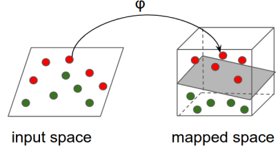
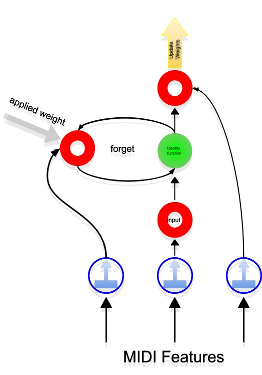
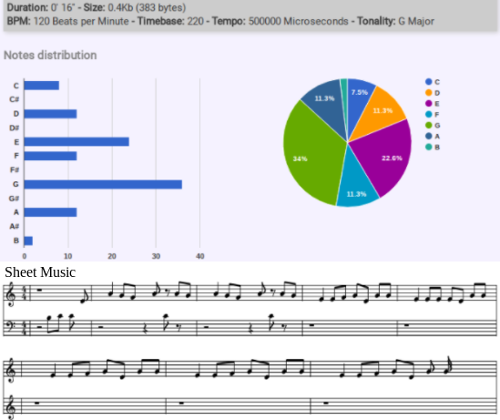
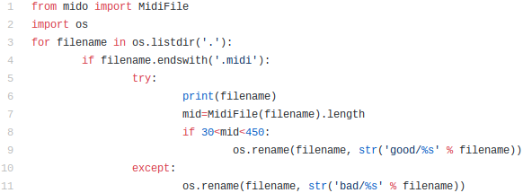
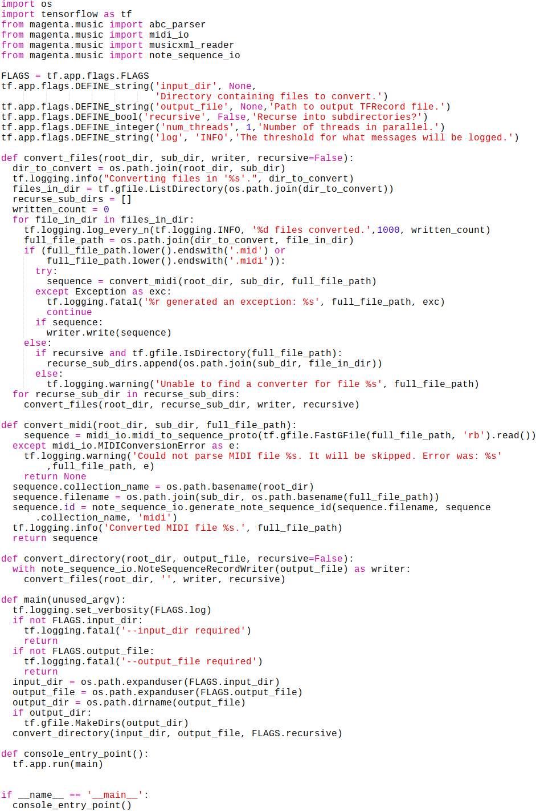
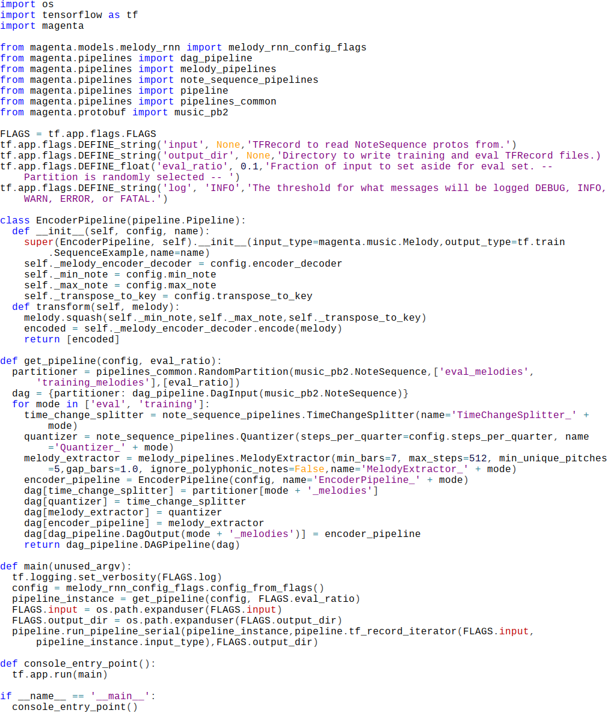
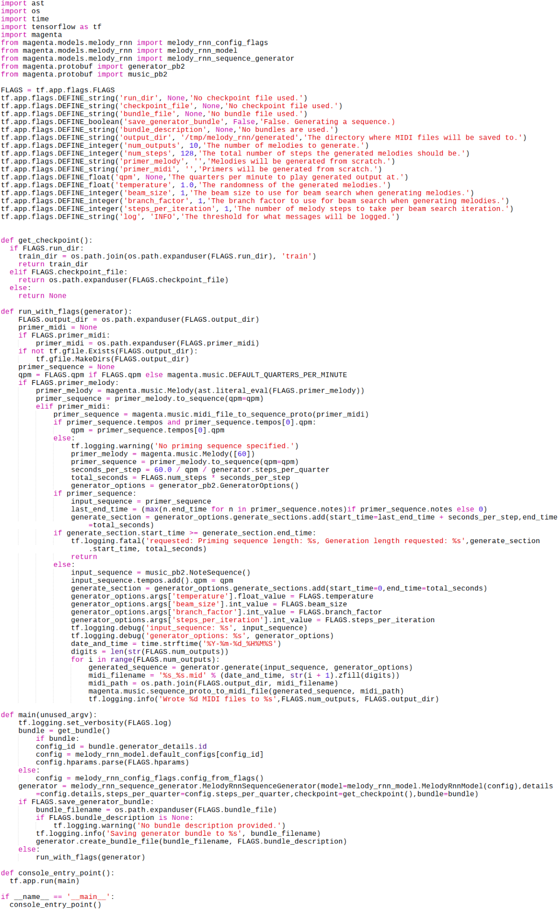
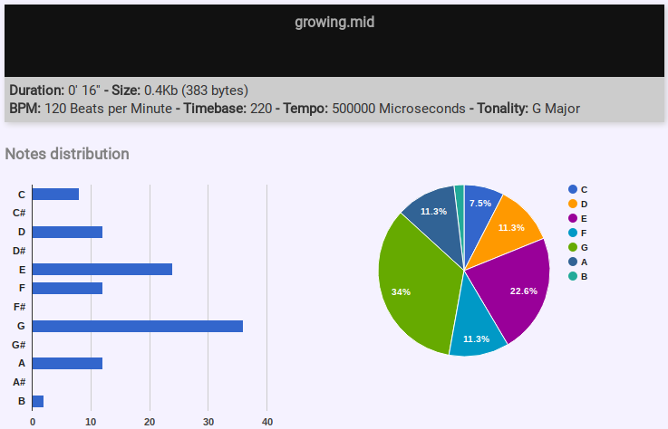
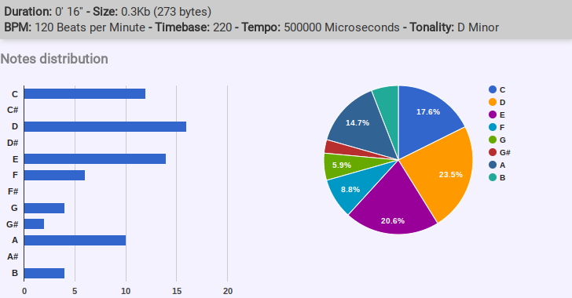
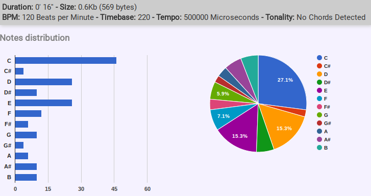

# Deep Learning Video Game Music Generation

Computer Science

> "How feasible are deep neural networks in generating thematically diverse video game music?"

By Spencer Churchill

---

Table of Contents

[Introduction](#h.2tl81ga24k8n) 1

[Research](#h.rfenre1atvp2) 1

[Historical Context](#h.vna4brjqgi3t) 2

[Theory](#h.pq8vv2ry3egw) 4

[Music](#h.778khdbnuqzl) 4

[Deep Learning](#h.mt9l54d7169n) 5

[Neural Network](#h.32yihahcqg4x) 10

[Design](#h.r987c8q380x) [1](#h.r987c8q380x)0

[Training Data](#h.vjd88jqd0odi) [1](#h.vjd88jqd0odi)1

[Normalization of Data](#h.wlwk6slypbdq) [1](#h.wlwk6slypbdq)1

[Training](#h.oq5ndkvr45bb) [1](#h.oq5ndkvr45bb)2

[Composition](#h.qpeo8zgigkku) [1](#h.qpeo8zgigkku)3

[Evaluation](#h.13bpi6rjv3jz) [1](#h.13bpi6rjv3jz)6

[Overview](#h.1ox4r07h009p) [1](#h.1ox4r07h009p)6

[Successes](#h.a1soj35yn4kn) [1](#h.a1soj35yn4kn)7

[Limitations](#h.wde0kh1l1pnh) [1](#h.wde0kh1l1pnh)7

[Conclusion](#h.nrfa816gz50) 18

[Background](#h.693onaoia2nx) 18

[Assessment](#h.gztohkoefjzc) 19

[Works Cited](#h.k5owcqe2zuq0) [2](#h.k5owcqe2zuq0)0

[Appendices](#h.ccp9iw2vwyml) [2](#h.ccp9iw2vwyml)3

[Appendix A ─ Video Games](#h.80vlnhaker6h) [2](#h.80vlnhaker6h)3

[Appendix B ─ Data Preparation](#h.eqj553m4o1d8) [2](#h.eqj553m4o1d8)4

[Appendix C ─ Deep Neural Network](#h.d1fffgg561ym) [2](#h.d1fffgg561ym)7

[Appendix D ─ Midi Analysis](#h.pndsnp1xlsux) 29

[Appendix E ─ Outlines](#h.g7c3dj7x9plu) [3](#h.g7c3dj7x9plu)3

[Appendix F ─ Sound Files](#h.sz0mvur1lr9g) [3](#h.sz0mvur1lr9g)4

---

# Introduction

## Research

The purpose of this paper is to test the ability of deep neural networks (DNNs), using long short-term memory architecture to model video game (VG) music and evaluate its aptitude in expressing thematically diverse emotion. In other words, how feasible are deep neural networks in generating thematic video game music? My goal is to test whether a DNN can compose engaging music capable of accentuating themes presented in video games. Research conducted for this paper uses the open source Tensorflow library − Magenta, along with other necessary libraries.[\[1\]](#ftnt1) The DNN analyzed 2,933 VG songs[\[2\]](#ftnt2) chosen for being timeless classics, was trained from that data, then created a model for generating music. Because neural networks process information similarly to a brain; e.g. receiving input (VG music), sequencing it through neurons (LSTM cells), then learning from it (adjusting weights), they are effective — unreasonably effective[\[3\]](#ftnt3) — especially when generalizing complex datasets. Music is an example of truly complex data.

Video game music adds to the canonical nature of music by not exclusively deriving value from aspects of traditional music such as jazz or classical scales, triplet eighth rhythms, or − time signatures, but from context presented in the game. In video games, music is essential. The storyline constantly presents a variety of scenes which convey emotion primarily through the use of engaging music.[\[4\]](#ftnt4) For example, in scenes of intensity, VG music will tend to Ionian (major)

modes and quick tempos, while during spooky scenes, suspense is built through slower tempos and lower pitches in minor keys. My model composed a fitting example of a spooky song ― shown in Figure 1.

Figure 1. Example of Spooky Music

In recent years, games have been structured with procedural generation[\[5\]](#ftnt5) which makes for a more individually adaptive approach; however, designing music for various locations (such as cave or underwater scenes) has become complicated since the map[\[6\]](#ftnt6) is consistently variable. To have the map and music generate as the user plays would lead to a completely unique gaming experience, far more immersive than games such as Minecraft or No Man’s Sky which only utilize procedural generation for game mapping. With the emergence of deep learning, generating music based on player action and context[\[7\]](#ftnt7) is a promising development in computer science and this research attempts to lay the foundation for this advancement for video games.

## Historical Context

The intrinsic connection between math and music has drawn attention across time from great thinkers such as Pythagoras[\[8\]](#ftnt8) and Euclid[\[9\]](#ftnt9) who believed mathematics played an essential role in music. However, the application of mathematical rules proved incapable of replicating the nuances of music until 1957, when Frank Rosenblatt developed the alpha Perceptron.[\[10\]](#ftnt10) His network parsed input data through matrices which recognized patterns of important features in the data. This statistical pattern recognition modeled neurons’ interactions (biological networking), bringing computer information processing closer to what is understood as "human."

Researchers tested the validity of more convoluted methods of data processing by creating models eventually capable of learning and generating music: some of these were Deep Neural Networks and Hidden Markov models (HMMs). Yet as a result of the lack of big data[\[11\]](#ftnt11) and computing power (Graphical Processing Units or GPUs) in the late 20th century, neither the DNN nor the HMM were feasible methods of generating music. That is until 2016 when Flow Machine[\[12\]](#ftnt12) composed Daddy’s Car using an HMM and Google released its open source deep learning library, Magenta[\[13\]](#ftnt13), which utilized long short-term memory (LSTM) DNNs in art-specific modeling. Developments of deep learning have not only been fueled by increasing computing power (Moore’s law) and big data but by the emergence of publicly available machine learning programs such as Tensorflow, Keras, and MXNet. This open source revolution[\[14\]](#ftnt14) enables individuals to learn about, participate in, and contribute to the cutting-edge development of AI.

---

# Theory

Both the theory behind VG music and deep learning, as well as their interactions, is essential for this research. In games, the storyline provides an understanding of context while music provides a map for emotion. By influencing the engagement of the game, music pushes the player past a simple visual story and into a cinematic experience. With the development of procedurally generated game maps, this essential question arises: can the underlying idea of map generation be applied to the generation of music?

## Music

Initially, the answer seems simple: no. Music is one of the humanities; it needs human input. And human input is necessary, especially for this research. The foundation of the model is reliant upon analysis of human creation. The training dataset is human-made songs in MIDI format, but once the model is trained and learns how VG music sounds, it generates its own. Two important features are presented regarding what the model aims to classify: the characterization and the sound of VG music. Often people recognize VG sounds as only "bleeps and bloops,"[\[15\]](#ftnt15) but they pose an important role in the reception of emotion. The tempo, for example, is influential in emotional response; action scenes present faster tempos than romantic scenes which both impact heart rate and stress levels differently. Dr. Rick Turner[\[16\]](#ftnt16) studied the emotional effect a classic game, Space Invaders,[\[17\]](#ftnt17)had on stress levels and concluded that as tempo increases (in response to dire situations) players’ heart and respiratory rates greatly increase relative to their baselines. This study supports the importance of the use of video game music in creating an emotional roadmap for context, and when done well, the effect is synergistic. Video game music is driven by the events taking place in the story and its sound is an attempt to enhance these events. Music influences emotion through three primary methods: tempo, octave, and key. An example of this is when players interpret a new character as a villain or hero by the type of music played; whether it is a quick or slow tempo, in a high or low octave, or in a major or minor key. In order for the DNN to be considered feasible, it must contain these elements representative of classic VG soundtracks — reflecting events and producing a response.

## Deep Learning

In order to assess whether a computer can generate compelling music, it is necessary to understand that deep learning is currently the most suited method. Deep learning, an emulated biological method of machine learning, is still completely mathematical (matrix-based), not having reached the sophistication of general artificial intelligence; however, deep learning processes data as a brain would: passing it through a simulated neuron (LSTM cell in this paper’s case), then learning from it. Mathematically, the model is essentially plotting each MIDI song in a high-dimensional space depending on its features, then using kernel methods (𝛗)[\[18\]](#ftnt18) to separate each song into their appropriate classifications.

The generation of songs according to what the model has learned is completed by having the model predict a point in the high dimensional learning space after training. Each point represents a MIDI song in the sense that the points’ coordinates are a list of unique features. The whole process can be separated and summarized in four parts: data collection, data processing, training, and generation.

1. Data Collection: Initially, a large data set of MIDI music is collected. A small collection of data results in a faulty model, unable to correctly identify the full-range of real-world data. Large datasets tend to aid in generalization rather than memorization.

2. Data Processing: The MIDI songs are then converted[\[19\]](#ftnt19) into a single file (notesequences.tfrecord) containing their features. Each feature is a unique characteristic of the MIDI such as the note, note intensity, decay time, and vibrato rate. Then, the file is separated into training and evaluation datasets.[\[20\]](#ftnt20) The purpose of separating the mass of MIDI files into these datasets is to prevent the model from overfitting, or memorizing, all the data, giving a high, but deceptive rate of accuracy. To protect against this, the model independently trains on the training dataset then assesses its accuracy by evaluating the evaluation dataset.

3. Training:[\[21\]](#ftnt21) Using the training dataset of MIDI files, the model plots the MIDI files in a high dimensional plane, with each unique feature of the MIDIs representing a coordinate. After plotting the points, the model begins to learn patterns which yield similarities within groups of MIDI songs. The model uses kernel similarity methods, such as the multi-class support vector machine (SVM),[\[22\]](#ftnt22) to calculate a hyperplane which separates the data into their respective classifications.

Figure 3. Visualization of Kernel Functions[\[23\]](#ftnt23)

This process is the model’s way of learning how video game music in MIDI format is commonly composed. This learning, or generalization, occurs when the LSTM cells’ values, called weights and biases, are adjusted according to the data parsed through them. The model analyzes each feature and continually updates its many layers of cells, attempting to generalize rules for accurate predictions until the training is stopped. The model’s ability to generalize data is later tested by measuring the number of accurate predictions divided by the total predictions made — yielding an accuracy metric.

4. Generation: The DNN model is finally used to generate its own data. By using advanced probability distributions and analyzing the high dimensional training map, it predicts the most probable first datapoint, then, depending on the first point, determines what the following point should be. It continues this process until a song of X data points has been generated. As shown in Figure 4, the structure of the LSTM cell enables the accurate modification of the weights of matrices (systems of equations) of terms, .

Figure 4. Architecture of an LSTM cell

These systems of equations create high dimensional graphs and are used able to generate each data point sequentially based on what it has learned from the analyzed training data. Simply put, the deep learning model learns complex patterns much like a human brain. By using the current and previous positions of the time step, the entire model determines what is probably the next data point to generate. "Essentially, the entire model is a big probability distribution."[\[24\]](#ftnt24)

According to this design, the model should be structurally primed for generalizing complex data such as video game music. Furthermore, the DNN ― coupled with an LSTM architecture for long-term data structure ― is currently the most feasible method of generating music since it is able to emulate biological information processing. In addition, the LSTM architecture retains defining features to produce long-term structure with repetition, or refrains.

The application of this theory on a topic such as VG music is new since the writing of this paper (May 2018). This is important since this ability to have a DNN recognize and compose thematically diverse pieces highlights the progress achieved in machine learning research ― having produced a predominantly generalized DNN. The specific DNN using LSTM cells for learning is especially effective when dealing with complex data, making it the best available option for learning thematically distinct video game music.

---

# Neural Network

The neural network used in this research is a deep neural network with an LSTM architecture. The most state-of-the-art machine learning program, Tensorflow, and its art modeling library, Magenta, were employed to process the information. After determining which libraries to use, I developed the model by first setting the number of input cells as the maximum possible outputs a MIDI could have per timestep (which is 24). Then to generalize, not memorize, information, I set up a bottleneck where the all possible data at any time-step is fed through 13 nodes (because of 12 notes in an octave and 1 note of silence, or rest), modulated, then passed to a layer of LSTM cells which are able to update matrices to retain long-term memory.

## Design

I used an LSTM instead of gated recurrent unit (GRU) architecture primarily because my goal was to generalize video game music as a whole and retain long-term structure. With the composition of music, two problems are common: one phrase is constantly repeated without elaboration or there are no motifs. LSTM networks solve both these problems. The activation function (or the identity function) of an LSTM-DNN is unique since it has a derivative of 1. This helps prevent against the vanishing or exploding gradient ― when the derivative of training or learning becomes either exponentially small or large ― since backpropagation remains constant because the identity function weighs at 1. The LSTM structure is able to accurately generalize long streams of information without overwriting important data in its matrices. Through the passing of huge amounts of data, the network can also begin to determine general features which define the data, or specifically, VG music.

---

## Training Data

The MIDI files were carefully selected from a variety of retro (vintage) video games,[\[25\]](#ftnt25) which rely more on music for their appeal than modern games which boast 3D graphics and immersive maps. I downloaded 2,933 VG songs to provide the DNN a large dataset to train and evaluate from. A popular game, Super Mario Bros., is a great example of a game mutually loved for its music as well as its gameplay. Designers recognize the importance of music to either evoke an enjoyable or Pavlovian response. In Super Mario Bros., the music at each level reflects the situations the player faces, i.e., underwater levels are enhanced with music using tremolo frequently, and the antagonist Bowser’s battles incorporating quick and intense music with blatant forte accents. Games in the retro era required captivating and recursive music as a means to draw the gamer deeper into the gaming dimension; thus, VG music inherently has the capability of representing a world through music. This capability to engage the player must be present in the compositions of the DNN in order for it to qualify as a method of feasible video game music generation.

## Normalization of Data

Initially, I began with 4,164 sound files, but many of these files were sound effects or music compilations (often used for credits), so I removed all audio below minute and above minutes.[\[26\]](#ftnt26) Afterward my training data consisted of 2,933 songs in MIDI format. Then, for the DNN to use the data, I normalized it to a very large array.[\[27\]](#ftnt27) The normalization modulated the songs in two important ways: first, it transposed them from -3 to +3 octaves (totalling 7 octaves including the tonic), then added 5 stretch factors to the data. As a result, my input data size increased by a factor of 35 compared to pre-normalization. Effectively, my dataset included 102,655 MIDI songs. This data was then parsed as a string of input vectors (tensors) and labels, retaining every feature. I separated 90% of the songs (92,389) in the array to the training dataset for training and the remaining 10% to the evaluation dataset[\[28\]](#ftnt28) for finding the real-world accuracy of the model. I used a Magenta provided program to parse the data into these two arrays.[\[29\]](#ftnt29) The data was then able to be understood and trained upon by the DNN.

## Training

Figure 5. Accuracy/ Learning Rate of the Neural Network

During the training process, each of the 4 layers of the DNN extracted features, or information, it recognized as important. Accuracy in terms of machine learning means the ability of the network to compose music containing the important features it recognized. When the DNN correctly identified key or consistent features of the sample VG music, the accuracy of the generated music increased as seen in Figure 5.

The increase in accuracy reinforces the network to continue its effective methods of learning. Eventually, the model learns important aspects of the training data (VG music) and is able to generalize and create its own data with more accuracy. A quarter of the way through the training ( ≈ step 4.00k ), the model was capable of generating viable video game music with a 7.5% probability. As training continued, it eventually ( ≈ step 15.00k ) was producing music with a 70% success probability.

Accuracy does not represent the nuances as the DNN further generalizes data, so although the accuracy may be reaching a logarithmic limit (Figure 5., asymptote ≈ .4), the generalization occurring can be at a much steeper derivative. In certain cases, with too many input nodes for a given sample size, the DNN memorizes instead of generalizing the data. The accuracy thus reaches a high but deceptive rate of 100% accuracy since the DNN is failing at creation by plagiarizing. Because of the deliberate bottleneck put on the DNN (number of input nodes and layers), it could not memorize the 2,933 MIDI songs, but was forced to learn their general structure instead.

## Composition

Immediately after the DNN began training, I had it generate a song. It outputted a chaotic mess of notes thrown on a staff (Figure 6); yet, this was to be expected.

Figure 6. Untrained Music Generation

After 15,000 training iterations, the DNN started to produce music consistent with VG genres as it began to identify characteristic features. The DNN learned the differences between ominous, victorious, and other thematic genres primarily due to the LSTM cells’ effective handling of long-term dependencies with the identity function.

Figure 7. Pleasant Generated Song

Nearing the end ( ≈ step 16.00k ) of the training process, 100% of the songs stayed in a specific key and contained refrains; yet, a majority ( ≈ 74% ) were basic and showed sparse creativity within musical phrases.

The song in Figure 6 lacks a discernible key[\[30\]](#ftnt30) and repeated refrain. Figure 7 on the other hand has a refrain reminiscent of video game music and a flow with constant rhythm, key, and complexity in its variety of notes. Comparing the two songs highlights the importance of training and the effectiveness of the training data. After 6 days, the network progressed from total ignorance in musical composition to the ability to generate refrains appropriate for VG environments in a consistent key. Given 144 hours of training, the DNN with an LSTM architecture performed excellently and proved to be a highly feasible method of composing short refrains for VG soundtracks. If provided more training time, the DNN would be capable of producing longer pieces of music; however, the current unoptimized hyperparameters of the DNN would bottleneck the ability to take full advantage of the training data. This is seen in the asymptotic approach ( .4 ) of its accuracy (Figure 5).

---

# Evaluation

## Overview

I evaluated this model by analyzing 320 songs generated by the DNN throughout the ( ≈ 16.00k ) training steps. As expected, the quality (specifically of consistent scale patterns, constant rhythm, and note complexity) of the generated songs increased over training time (144 hours). Distinct themes were also learned from the DNN as the t-SNE visualization suggests (Figure 8). The DNN learned enough prevalent information in the huge arrays of parsed MIDIs to separate songs with minor keys and songs with quick tempos. This feature analysis is later confirmed by the ability of the DNN to compose songs with 26% chance of showing distinctly thematic phrases shown in Figure 8. This project confirms that machine learning has progressed immensely as it can produce, with a 26% chance, music viable enough to be implemented into a game. Despite this ability to compose music, the program still lacks consistency in the aesthetics of music. The network is currently not at a level where it can be implemented into a modern game; however, it can be used to create potential game songs, then expanded upon by VG music composers.

---

## Successes

In terms of becoming more similar to a biological human mind, biological networking in DNNs advance artificial intelligence with deep learning and an LSTM architecture. This research furthers the merging of artistic and AI movements; however, the possibility of generating music procedurally would only be possible with more training, an efficient generation method, and more powerful hardware. Out of a batch of 10 generated songs, typically 3 are enjoyable to listen to and contain intriguing compositional elements. This would be helpful for independent (or indie) game developers looking for royalty-free music ideas rather than full-fledged integration into games. The goal of this research was to test how feasible deep neural networks are in the composition of video game music. My final conclusion is that the DNN is most feasible in providing ideas rather than an integration into games given its unoptimized hyperparameters.

## Limitations

Only 30 years ago, the Nintendo Game Boy was struggling to balance music with sound effects on its arbitrary 4-bit wave channel, but now large AAA[\[31\]](#ftnt31) video games often have world-renowned orchestras performing their music for a high quality gaming experience. This poses a difficulty for the DNN since it is based on MIDI generation. This DNN is only currently capable of generating music for a retro-styled game. For AAA VG usage, an implementation of direct wave transformation (similar to WaveNet)[\[32\]](#ftnt32) using a DNN-LSTM design would eventually be able to procedurally generate orchestral sounding music on gaming devices of the near-future (in around 5 years according to Moore’s Law).

---

# Conclusion

## Background

Until recently, only humans were capable of creative action to the extent of composing music; however, machine learning is challenging prior paradigms by leading computers to the frontier of artificial general intelligence. Computer-generated music has been in development since Alan Turing began the integration of technologies and arts[\[33\]](#ftnt33) by transposing music for a computer to perform. Despite this capacity spanning over half a century, considerable progress only recently emerged due to the development of the graphical processing unit and deep learning in 2005. These advancements facilitated the paramount relationship between machine and human intelligence toward the creation of artificial intelligence.

By utilizing Google’s Tensorflow library, Magenta, I tested deep learning beyond previous bounds by training my model on video game music as a whole instead of focusing on only one genre such as romantic, reggae, or jazz. This challenged the capabilities of deep neural networks since throughout a game many themes are presented; ranging from war, defeat and victory, to love and death. The aesthetics of music are ultimately subjective; nevertheless, my analysis, in an attempt to mitigate biases, individually assigned value to consistent scale patterns, constant rhythm, and note complexity for each generated song.

This deep generative model, using a long short-term memory architecture, trained on 2,933 video game songs, recognized unique themes, then however short, created its own original and compelling refrains from them. Despite the successful brief compositions, the network is not yet feasible as a method of generating modern VG music since games require consistent musical quality. I predict within the next 5 years, research such as this will likely be implemented into video games to provide real-time procedural direct-wave music generation.

## Assessment

This research resulted in the creation of a DNN capable of generating thematic and compelling motifs and phrases. These refrains however, were short and often repetitive beyond a 30 second time frame (slight vanishing gradient issue). How feasible was the DNN in generating video game music? This network was feasible in a raw sense, offering only the necessary catchy phrase to hook the player in momentarily. This project requires enhanced hardware and more effective machine learning libraries to provide real-time, high-fidelity music generation in video games, especially games with the expectation of direct-wave rather than MIDI music. Although this DNN is ineffective for large-scale, AAA games, it could be improved, then implemented in retro style games typically possessing MIDI/ 8-bit music. The recent interest in nostalgic gaming has sent indie games such as Shovel Knight and Celeste to the top of the charts ― this research proves very feasible for projects such as these. The conclusion for this paper is that, for nostalgic, 8-bit style games, this DNN is a feasible and innovative method of generating music.

---

# Works Cited

Adams, Tarn. Procedural Generation in Game Design. Productivity Press, 2017.

Agnello, Anthony John. "The 25 Greatest Video Game Soundtracks of All Time." GamesRadar+, 29 June 2016, [www.gamesradar.com/the-25-greatest-video-game-soundtracks-of-all-time/](https://www.google.com/url?q=http://www.gamesradar.com/the-25-greatest-video-game-soundtracks-of-all-time/&sa=D&source=editors&ust=1646112990607469&usg=AOvVaw0rjwUwt-5iiXXPE5UosRYH). Accessed 2 June 2017.

Arthur, Lisa. "What Is Big Data?" Forbes, Forbes Magazine, 15 Aug. 2013, [www.forbes.com/sites/lisaarthur/2013/08/15/what-is-big-data/](https://www.google.com/url?q=http://www.forbes.com/sites/lisaarthur/2013/08/15/what-is-big-data/&sa=D&source=editors&ust=1646112990608045&usg=AOvVaw2JYi6ZJ53FnUPTTUJ_TFS6). Accessed 29 Oct. 2017.

DeMaria, Rusel, and Johnny L. Wilson. High Score!: the Illustrated History of Electronic Games. 1, McGraw-Hill/ Osborne, 2004. ISBN 0-07-222428-2.

Eck, Douglas. "Magenta." Magenta, Google, 2016, [www.magenta.tensorflow.org/](https://www.google.com/url?q=https://magenta.tensorflow.org/&sa=D&source=editors&ust=1646112990608594&usg=AOvVaw3bmZYPL8shM7oheoM9_c0G). Accessed 27 Aug. 2017.

Euclid. "Στοιχεῖα Stoicheia." The Elements, 300 BCE.

Fitzpatrick, Alex. "Best Video Games of All Time: TIME's Top 50." Time, Time, 23 Aug. 2016, [www.time.com/4458554/best-video-games-all-time/](https://www.google.com/url?q=http://www.time.com/4458554/best-video-games-all-time/&sa=D&source=editors&ust=1646112990609169&usg=AOvVaw25BVZ7B5fmICOaWrPxQUex). Accessed 30 May 2017.

Hawthorne, Curtis. "Tensorflow/Magenta." GitHub, Google, 30 Oct. 2017, [www.github.com/tensorflow/magenta/blob/master/magenta/scripts/convert_dir_to_note_se](https://www.google.com/url?q=http://www.github.com/tensorflow/magenta/blob/master/magenta/scripts/convert_dir_to_note_sequences.py&sa=D&source=editors&ust=1646112990609599&usg=AOvVaw1002HKNPRjNEfUdek2GjRn) [quences.py](https://www.google.com/url?q=http://www.github.com/tensorflow/magenta/blob/master/magenta/scripts/convert_dir_to_note_sequences.py&sa=D&source=editors&ust=1646112990609941&usg=AOvVaw35Xijz3VlNrDePG8oP6OUL). Accessed 5 Nov. 2017.

Karpathy, Andrej. "The Unreasonable Effectiveness of Recurrent Neural Networks." The Unreasonable Effectiveness of Recurrent Neural Networks, [www.karpathy.github.io/2015/05/21/rnn-effectiveness/](https://www.google.com/url?q=http://www.karpathy.github.io/2015/05/21/rnn-effectiveness/&sa=D&source=editors&ust=1646112990610430&usg=AOvVaw3hrmWBYZRXkGHuqbd4VRrK). Accessed 20 Sep. 2017.

Kung, S. Y. "Machine Learning and Kernel Vector Spaces." Kernel Methods and Machine Learning, June 2014, pp. 1–2., doi:10.1017/cbo9781139176224.002.

Murphy, Kevin P. Machine Learning: a Probabilistic Perspective. MIT Press, 2013.

Nishikado, Tomohiro. "Space Invaders." Space Invaders, Taito, 1978, [www.spaceinvaders.net/](https://www.google.com/url?q=http://www.spaceinvaders.net/&sa=D&source=editors&ust=1646112990611184&usg=AOvVaw3pYsOdJsWoSVnHFqfKv_Ju). Accessed 4 Dec. 2017.

NPR. "The Evolution of Video Game Music." NPR, 13 Apr. 2008, [www.npr.org/templates/story/story.php?storyId=89565567](https://www.google.com/url?q=http://www.npr.org/templates/story/story.php?storyId%3D89565567&sa=D&source=editors&ust=1646112990611691&usg=AOvVaw1l13c9aPaZ9ICWPU1g1oQO). Accessed 4 Nov. 2017.

Pachet, François. "AI Music-Making." Flow Machines, Sony CSL, 19 Sept. 2016, [www.flow-machines.com/](https://www.google.com/url?q=http://www.flow-machines.com/&sa=D&source=editors&ust=1646112990612081&usg=AOvVaw1FafcKrQGVXqq1zheM4ay0). Accessed 27 Aug. 2017.

Plans, David & Morelli, Davide. (2012). Experience-Driven Procedural Music Generation for Games. Computational Intelligence and AI in Games, IEEE Transactions on. 4. 192-198. 10.1109/TCIAIG.2012.2212899.

Pythagoras. "Musica Universalis." Harmony of the Spheres, 6th Century BCE.

Roberts, Adam. "Tensorflow/Magenta." GitHub, Google, 23 May 2017, [www.github.com/tensorflow/magenta/blob/master/magenta/models/melody_rnn/melody_rn](https://www.google.com/url?q=http://www.github.com/tensorflow/magenta/blob/master/magenta/models/melody_rnn/melody_rnn_generate.py&sa=D&source=editors&ust=1646112990612824&usg=AOvVaw13FICFd7fYEjxOwPHOpIJY) [n_generate.py](https://www.google.com/url?q=http://www.github.com/tensorflow/magenta/blob/master/magenta/models/melody_rnn/melody_rnn_generate.py&sa=D&source=editors&ust=1646112990613178&usg=AOvVaw10ia7uAz1k9WS4G7X71GcR) Accessed 22 June 2017.

Rosenblatt, Frank. The perceptron, a perceiving and recognizing automaton Project Para. Cornell Aeronautical Laboratory, 1957.

Schillinger, Raymond. "The Open Source Revolution." The Huffington Post, TheHuffingtonPost.com, 15 Feb. 2011, [www.huffingtonpost.com/raymond-schillinger/the-open-source-revolutio_b_823112.html](https://www.google.com/url?q=http://www.huffingtonpost.com/raymond-schillinger/the-open-source-revolutio_b_823112.html&sa=D&source=editors&ust=1646112990613819&usg=AOvVaw3zA3H3Bq_R3kcGdFt2zX0U) Accessed 29 Oct. 2017.

Seabrook, Andrea, and Jack Wall. "All Things Considered." The Evolution of Video Game Music, National Public Radio, 13 Apr. 2008.

Simon, Ian. "Tensorflow/Magenta." GitHub, Google, 19 June 2017, [www.github.com/tensorflow/magenta/blob/master/magenta/models/melody_rnn/melody_rn](https://www.google.com/url?q=http://www.github.com/tensorflow/magenta/blob/master/magenta/models/melody_rnn/melody_rnn_create_datset.py&sa=D&source=editors&ust=1646112990614685&usg=AOvVaw0kwD1NmLSZaoCjQjhwCuFd) [n_create_datset.py](https://www.google.com/url?q=http://www.github.com/tensorflow/magenta/blob/master/magenta/models/melody_rnn/melody_rnn_create_datset.py&sa=D&source=editors&ust=1646112990615045&usg=AOvVaw3LMSWSkh_lg7O4SnFfoTMq). Accessed 22 June 2017.

Tang, Yuan. Kernel Mapping. Digital image. Improving Linear Models Using Explicit Kernel Methods. Google, 2 Nov. 2017. Web. <[www.tensorflow.org/tutorials/kernel\_methods](https://www.google.com/url?q=https://www.tensorflow.org/tutorials/kernel_methods&sa=D&source=editors&ust=1646112990615575&usg=AOvVaw1Xa4N5-exGMoa7LmJy-adq)\>. Accessed 3 Dec. 2017.

Turner, J. R., Carroll, D. and Courtney, H. (1983), Cardiac and Metabolic Responses to "Space Invaders": An Instance of Metabolically-Exaggerated Cardiac Adjustment?. Psychophysiology, 20: 544–549. doi:10.1111/j.1469-8986.1983.tb03010.x

Van Den Oord, Aaron, et al. "Wavenet: A generative model for raw audio." arXiv preprint arXiv:1609.03499 (2016). VGMusic. "Video Game Music Archive." VGMusic - XX,XXX Game Music MIDI Files, Shane Evans, [www.vgmusic.com/](https://www.google.com/url?q=http://www.vgmusic.com/&sa=D&source=editors&ust=1646112990616317&usg=AOvVaw244UuvM3Jv1ZAv4qhu93b-). Accessed 3 June 2017.

Wellington, Agence France-Presse in. "First Recording of Computer-Generated Music" The Guardian, Guardian News and Media, 26 Sept. 2016, [www.theguardian.com/science/2016/sep/26/first-recording-computer-generated-music-created-alan-turing-restored-enigma-code](https://www.google.com/url?q=http://www.theguardian.com/science/2016/sep/26/first-recording-computer-generated-music-created-alan-turing-restored-enigma-code&sa=D&source=editors&ust=1646112990616854&usg=AOvVaw1IZBr3SX0_HmqnG-cB3GAt). Accessed 10 Oct. 2017.

Wang, Zhe, and Xiangyang Xue. "Multi-Class Support Vector Machine." Support Vector Machines Applications, 2014, pp. 23–48., doi:10.1007/978-3-319-02300-7_2.

---

# Appendices

## Appendix A ─ Video Games[\[34\]](#ftnt34), [\[35\]](#ftnt35)

1. Super Mario Bros.
2. Pokémon
3. Tetris
4. Zelda
5. Kirby
6. Donkey Kong
7. Metroid
8. Halo
9. Galaga
10. Chrono Trigger
11. Street Fighter
12. Metal Gear Solid
13. Castlevania
14. Mass Effect
15. Advance Wars
16. Kingdom Hearts
17. Professor Layton
18. Fire Emblem
19. Mega Man
20. Final Fantasy
21. Sonic the Hedgehog
22. Elder Scrolls
23. Baldur’s Gate

## Appendix B ─ Data Preparation

MIDI Size Sorter:

MIDI Sequencer:[\[36\]](#ftnt36)

Create Datasets (Training and Evaluation):[\[37\]](#ftnt37)

---

## Appendix C ─ Deep Neural Network

Model:

Training:

Generate:[\[38\]](#ftnt38)

## Appendix D ─ Midi Analysis

Song 1 (Note Breakdown):

Song 1 (Sheet Music \~ Pleasant):

Song 2 (Note Breakdown):

Song 2 (Sheet Music \~ Spooky):

Song 3 (Note Breakdown):

Song 3 (Sheet Music \~ Funky):

Song 4 (Note Breakdown):

Song 4 (Sheet Music \~ Chaotic):

---

## Appendix E ─ Outlines

Computer - Google Virtual Machine (Training Model \~ 6 Days):

CPU:

- (8) Intel® Xeon® Processor E5-2660

RAM:

- 52 Gigabytes of DDR4

OS:

- Linux (Debian 8 "Jessie")

Libraries:

- Python 2.7
- Python-pip
- matplotlib, scipy, bokeh, IPython, pandas
- Tensorflow
- Magenta
- Bazel

Commands

1. Note Sequence:
   ./bazel-bin/magenta/scripts/convert_dir_to_note_sequences --input_dir=\~/ee/midi/ --output_file=\~/ee/res/notesequences.tfrecord --num_threads=64 --log=INFO

2. Dataset:
   ./bazel-bin/magenta/melody_rnn_create_dataset --config=attention_rnn --input=\~/ee/res/notesequences.tfrecord --output_dir=\~/ee/res/out/ --eval_ratio=0.01

3. Train:
   ./bazel-bin/magenta/train --config=attention_rnn --run_dir=\~/ee/res/rundir/ --sequence_example_file=\~/ee/res/out/training_melodies.tfrecord --hparams="batch_size=512,rnn_layer_sizes=\[64,64\]"

4. Generate:
   ./bazel-bin/magenta/generate --config=attention_rnn --run_dir=\~/ee/res/rundir/ --output_dir=\~/ee/res/generated/ --num_outputs=10 --num_steps=480 --hparams="batch_size=512,rnn_layer_sizes=\[64,64\]" --primer_melody="\[\]"

## Appendix F ─ Sound Files

1. Song 1 (Audio \~ Pleasant)

[www.soundcloud.com/splch/growing?in=splch/sets/magenta-video-game-music](https://www.google.com/url?q=https://soundcloud.com/splch/growing?in%3Dsplch/sets/magenta-video-game-music&sa=D&source=editors&ust=1646112990627928&usg=AOvVaw0iP8VjFY0SESF7YksSeK5Q)

2. Song 2 (Audio \~ Spooky)

[www.soundcloud.com/splch/spooky?in=splch/sets/magenta-video-game-music](https://www.google.com/url?q=https://soundcloud.com/splch/spooky?in%3Dsplch/sets/magenta-video-game-music&sa=D&source=editors&ust=1646112990628555&usg=AOvVaw2JiPRvIuTXtAuGNMEeZsCn)

3. Song 3 (Audio \~ Funky)

[www.soundcloud.com/splch/technocafe?in=splch/sets/magenta-video-game-music](https://www.google.com/url?q=https://soundcloud.com/splch/technocafe?in%3Dsplch/sets/magenta-video-game-music&sa=D&source=editors&ust=1646112990629058&usg=AOvVaw1Ps8MGq0sWXiRFqGcIW4sc)

4. Song 4 (Audio \~ Chaotic)

[www.soundcloud.com/splch/mash?in=splch/sets/magenta-video-game-music](https://www.google.com/url?q=https://soundcloud.com/splch/mash?in%3Dsplch/sets/magenta-video-game-music&sa=D&source=editors&ust=1646112990629621&usg=AOvVaw38l4nnRDiMlQ8GWYxdXGh0)

---

[\[1\]](#ftnt_ref1) Appendix E, 2.2.1

[\[2\]](#ftnt_ref2) "Video Game Music Archive." VGMusic - XX,XXX Game Music MIDI Files, Shane Evans, [www.vgmusic.com/](https://www.google.com/url?q=https://www.vgmusic.com/&sa=D&source=editors&ust=1646112990639137&usg=AOvVaw2vMvE6Sx1X95VjnqHWEvAn). Accessed 3 June 2017.

[\[3\]](#ftnt_ref3) Karpathy, Andrej. "The Unreasonable Effectiveness of Recurrent Neural Networks." The Unreasonable Effectiveness of Recurrent Neural Networks, [www.karpathy.github.io/2015/05/21/rnn-effectiveness/](https://www.google.com/url?q=https://karpathy.github.io/2015/05/21/rnn-effectiveness/&sa=D&source=editors&ust=1646112990639662&usg=AOvVaw1kznhIRGtviEScR1XCElB9). Accessed 20 Sep. 2017.

[\[4\]](#ftnt_ref4) "The Evolution of Video Game Music." NPR, NPR, 13 Apr. 2008, [www.npr.org/templates/story/story.php?storyId=89565567](https://www.google.com/url?q=http://www.npr.org/templates/story/story.php?storyId%3D89565567&sa=D&source=editors&ust=1646112990640094&usg=AOvVaw3G0dgehXdy2Md02L70FNzp). Accessed 4 Nov. 2017.

[\[5\]](#ftnt_ref5) Adams, Tarn. Procedural Generation in Game Design. Productivity Press, 2017.

[\[6\]](#ftnt_ref6) The total space available to the player during the course of completing a discrete objective.

[\[7\]](#ftnt_ref7) Plans, David & Morelli, Davide. (2012). Experience-Driven Procedural Music Generation for Games. Computational Intelligence and AI in Games, IEEE Transactions on. 4. 192-198. 10.1109/TCIAIG.2012.2212899.

[\[8\]](#ftnt_ref8) Pythagoras. "Musica Universalis." Harmony of the Spheres, 6th Century BCE.

[\[9\]](#ftnt_ref9) Euclid. "Στοιχεῖα Stoicheia." The Elements, 300 BCE.

[\[10\]](#ftnt_ref10) Rosenblatt, Frank. The perceptron, a perceiving and recognizing automaton Project Para. Cornell Aeronautical Laboratory, 1957.

[\[11\]](#ftnt_ref11) Arthur, Lisa. "What Is Big Data?" Forbes, Forbes Magazine, 15 Aug. 2013, [www.forbes.com/sites/lisaarthur/2013/08/15/what-is-big-data/](https://www.google.com/url?q=http://www.forbes.com/sites/lisaarthur/2013/08/15/what-is-big-data/&sa=D&source=editors&ust=1646112990632008&usg=AOvVaw04vtI2_TbVcyFNl1TJJBOV). Accessed 29 Oct. 2017.

[\[12\]](#ftnt_ref12) Pachet, François. "AI Music-Making." Flow Machines, Sony CSL, 19 Sept. 2016, [www.flow-machines.com/](https://www.google.com/url?q=http://www.flow-machines.com/&sa=D&source=editors&ust=1646112990631069&usg=AOvVaw3umltqhwUIm1Dc5l7e-rol). Accessed 20 Aug. 2017.

[\[13\]](#ftnt_ref13) Eck, Douglas. "Magenta." Magenta, Google, 2016, [www.magenta.tensorflow.org/](https://www.google.com/url?q=https://magenta.tensorflow.org/&sa=D&source=editors&ust=1646112990631561&usg=AOvVaw2-tBwxb5UsFWYaS7ZNVnNp). Accessed 27 Aug. 2017.

[\[14\]](#ftnt_ref14) Schillinger, Raymond. "The Open Source Revolution." The Huffington Post, TheHuffingtonPost.com, 15 Feb. 2011, [www.huffingtonpost.com/raymond-schillinger/the-open-source-revolutio_b_823112.html](https://www.google.com/url?q=https://www.huffingtonpost.com/raymond-schillinger/the-open-source-revolutio_b_823112.html&sa=D&source=editors&ust=1646112990630398&usg=AOvVaw2_WgBQW0_6_T9NDs_xdM2w). Accessed 29 Oct. 2017.

[\[15\]](#ftnt_ref15) Seabrook, Andrea, and Jack Wall. "All Things Considered." The Evolution of Video Game Music, National Public Radio, 13 Apr. 2008.

[\[16\]](#ftnt_ref16) Turner, J. R., Carroll, D. and Courtney, H. (1983), Cardiac and Metabolic Responses to "Space Invaders": An Instance of Metabolically-Exaggerated Cardiac Adjustment?. Psychophysiology, 20: 544–549. doi:10.1111/j.1469-8986.1983.tb03010.x

[\[17\]](#ftnt_ref17) Nishikado, Tomohiro. "Space Invaders." Space Invaders, Taito, 1978, [www.spaceinvaders.net](https://www.google.com/url?q=http://www.spaceinvaders.net&sa=D&source=editors&ust=1646112990636377&usg=AOvVaw0fMbp0jPHlgnhHRFITXs8y)/. Accessed 4 Dec. 2017.

[\[18\]](#ftnt_ref18) Kung, S. Y. "Machine Learning and Kernel Vector Spaces." Kernel Methods and Machine Learning, June 2014, pp. 1–2., doi:10.1017/cbo9781139176224.002.

[\[19\]](#ftnt_ref19) Appendix E, 3.1.1

[\[20\]](#ftnt_ref20) Appendix E, 3.2.1

[\[21\]](#ftnt_ref21) Appendix E, 3.3.1

[\[22\]](#ftnt_ref22) Wang, Zhe, and Xiangyang Xue. "Multi-Class Support Vector Machine." Support Vector Machines Applications, 2014, pp. 23–48., doi:10.1007/978-3-319-02300-7_2.

[\[23\]](#ftnt_ref23) Tang, Yuan. Kernel Mapping. Digital image. Improving Linear Models Using Explicit Kernel Methods. Google, 2 Nov. 2017. Web. <[www.tensorflow.org/tutorials/kernel\_methods](https://www.google.com/url?q=https://www.tensorflow.org/tutorials/kernel_methods&sa=D&source=editors&ust=1646112990636886&usg=AOvVaw2q2IQY-VRddm4tMxs03unH)\>. Accessed 3 Dec. 2017.

[\[24\]](#ftnt_ref24) Murphy, Kevin P. Machine Learning: a Probabilistic Perspective. MIT Press, 2013.

[\[25\]](#ftnt_ref25) Appendix A

[\[26\]](#ftnt_ref26) Appendix B, MIDI Size Sorter

[\[27\]](#ftnt_ref27) Appendix B, MIDI Sequencer

[\[28\]](#ftnt_ref28) Appendix E, 3.2.1

[\[29\]](#ftnt_ref29) Appendix B, Create Datasets (Training and Evaluation)

[\[30\]](#ftnt_ref30) Appendix D, Song 4 (Note Breakdown)

[\[31\]](#ftnt_ref31) DeMaria, Rusel, and Johnny L. Wilson. High Score!: the Illustrated History of Electronic Games. 1, McGraw-Hill/ Osborne, 2004. ISBN 0-07-222428-2.

[\[32\]](#ftnt_ref32) Van Den Oord, Aaron, et al. "Wavenet: A generative model for raw audio." arXiv preprint arXiv:1609.03499 (2016).

[\[33\]](#ftnt_ref33) Wellington, Agence France-Presse in. "First Recording of Computer-Generated Music" The Guardian, Guardian News and Media, 26 Sept. 2016, [www.theguardian.com/science/2016/sep/26/first-recording-computer-generated-music-created-alan-turing-restored-enigma-code](https://www.google.com/url?q=http://www.theguardian.com/science/2016/sep/26/first-recording-computer-generated-music-created-alan-turing-restored-enigma-code&sa=D&source=editors&ust=1646112990638588&usg=AOvVaw1HAYcMnmRjx9Z_Ob75aYkt). Accessed 10 Oct. 2017.

[\[34\]](#ftnt_ref34) Agnello, Anthony John. "The 25 Greatest Video Game Soundtracks of All Time." GamesRadar+, 29 June 2016, [www.gamesradar.com/the-25-greatest-video-game-soundtracks-of-all-time/](https://www.google.com/url?q=http://www.gamesradar.com/the-25-greatest-video-game-soundtracks-of-all-time/&sa=D&source=editors&ust=1646112990633077&usg=AOvVaw3FaIHiOiwlDQ1w3SP7_Tha). Accessed 2 June 2017.

[\[35\]](#ftnt_ref35) Fitzpatrick, Alex. "Best Video Games of All Time: TIME's Top 50." Time, Time, 23 Aug. 2016, [www.time.com/4458554/best-video-games-all-time/](https://www.google.com/url?q=http://www.time.com/4458554/best-video-games-all-time/&sa=D&source=editors&ust=1646112990632479&usg=AOvVaw22AuyLJKZ4QFHBgDMrFcXI). Accessed 30 May 2017.

[\[36\]](#ftnt_ref36) Hawthorne, Curtis. "Tensorflow/Magenta." GitHub, Google, 30 Oct. 2017, [www.github.com/tensorflow/magenta/blob/master/magenta/scripts/convert_dir_to_note_sequences.py](https://www.google.com/url?q=http://www.github.com/tensorflow/magenta/blob/master/magenta/scripts/convert_dir_to_note_sequences.py&sa=D&source=editors&ust=1646112990633648&usg=AOvVaw0s_t7FB-1p-T2D3IpFpGpH). Accessed 5 Nov. 2017.

[\[37\]](#ftnt_ref37) Simon, Ian. "Tensorflow/Magenta." GitHub, Google, 19 June 2017, [www.github.com/tensorflow/magenta/blob/master/magenta/models/melody_rnn/melody_rnn_create_datset.py](https://www.google.com/url?q=http://www.github.com/tensorflow/magenta/blob/master/magenta/models/melody_rnn/melody_rnn_create_dataset.py&sa=D&source=editors&ust=1646112990634217&usg=AOvVaw30w8oOa_96riILMmFluziv). Accessed 22 June 2017.

[\[38\]](#ftnt_ref38) Roberts, Adam. "Tensorflow/Magenta." GitHub, Google, 23 May 2017, [www.github.com/tensorflow/magenta/blob/master/magenta/models/melody_rnn/melody_rnn_generate.py](https://www.google.com/url?q=http://www.github.com/tensorflow/magenta/blob/master/magenta/models/melody_rnn/melody_rnn_generate.py&sa=D&source=editors&ust=1646112990634712&usg=AOvVaw18iI_OYjTaD-37eAxphlRW) Accessed 22 June 2017.
