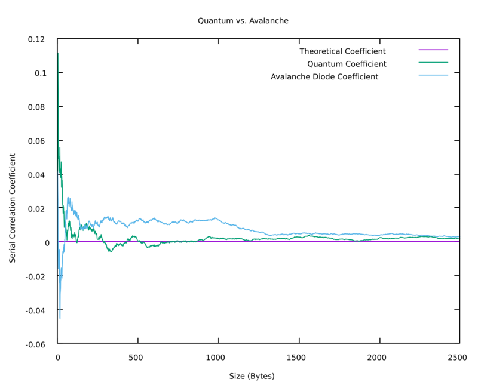

In a previous post comparing quantum and avalanche diode methods of true random number generation, an interesting pattern emerged. The quantum random numbers would pass more STS tests than avalanche diode random numbers. Seemingly, the quantum RNG converges to a mean before the diode RNG.

This should not be the case since both methods produce true random numbers, so this post will be exploring if this is actually occurring and why.

## Code

We'll be using `C` to do this analysis since it's fast enough for the scale I need.

The first task will be opening a file of random data by variable amounts. The [`fread`](https://pubs.opengroup.org/onlinepubs/9699919799/functions/fread.html#tag_16_164) command takes a filename and number of bytes to read as arguments, so that'll work well.

Specifically, the file (let's call it `random`) needs to be read in incrementing amounts, so the code will look like this:

```c
#define MAX_READ 5
#define FILE_NAME "random"

…

FILE * stream = fopen(FILE_NAME, "r");

for (unsigned long bytes = 0; bytes < MAX_READ; bytes++) {
	char buffer[bytes];
	fread(&buffer, sizeof(char), bytes, stream);
}
```

This is storing some number of bytes in a buffer array. Now we can iterate through that array to determine the mean. Keep in mind that the theoretical mean is 0.5, so this is eventually going to compare the rates at which quantum and avalanche diode RNGs converge to the theoretical mean.

We're iterating through 8 bits at a time, so to find each binary mean, we'll count the number of ones in binary and divide by 8.

```c
static inline float binaryMean(char byte) {
	// https://stackoverflow.com/a/698183
	return (byte * 01001001001ULL & 042104210421ULL)
		% 017 / 8.0;
}
```

The remainder is just reading multiple files and parsing the data as a <abbr title="Comma-Separated Values">CSV</abbr>.

```c
#include <stdio.h>
#include <stdlib.h>
#define MAX_READ 1000

long double array[2][MAX_READ];

static inline float binaryMean(unsigned char byte) {
  return (byte * 01001001001ULL & 042104210421ULL) % 017 / 8.0;
}

void analyzeFile(const char *filename, const char filenum) {
  FILE *stream = fopen(filename, "r");

  for (unsigned long bytes = 1; bytes <= MAX_READ; bytes++) {
    char buffer[bytes];
    fread(&buffer, sizeof(char), bytes, stream);

    long double mean = 0;
    for (unsigned long i = 0; i < bytes; i++) {
      mean += binaryMean(buffer[i]);
    }

    array[filenum][bytes - 1] = mean / bytes;
  }

  fclose(stream);
}

int main() {
  analyzeFile("../../randomReports/quantum", 0);
  analyzeFile("../../randomReports/avalanche", 1);

  printf("Theoretical Mean,Quantum Mean,Avalanche Diode Mean\n");

  for (unsigned long line = 0; line < MAX_READ; line++) {
    printf("0.5,%Lf,%Lf\n", array[0][line], array[1][line]);
  }

  return 0;
}
```

The astute among us 🔴 will notice that I'm printing the data to stout; however, I'll actually pull a \*nix and piping the output to gnuplot.

```shell
gcc -c -o main.o main.c && gcc ./main.o -o main && ./main | cat > /tmp/gnuplotdata.csv && gnuplot -p -e "set title 'Quantum vs. Avalanche';set xlabel 'Average Length';set ylabel 'Average';set datafile separator ',';plot for [col=1:3] '/tmp/gnuplotdata.csv' using col with lines title columnheader;pause -1"
```

That's _sus_ but why have pipes if you never use them? Anyways, we can now begin comparing convergence.

## Analysis


This is the plot outputted by gnuplot and it looks like both RNGs converge to 0.5 at equal rates.

> The differing rates to randomness is deeper than approaching the mean.

I'll now be using the [ent](https://www.fourmilab.ch/random/) tool for statistical testing.

```shell
dd if=../../randomReports/randomData bs=104857601 count=8 iflag=fullblock 2>/dev/null | ent -b
```

<details>

<summary>Quantum</summary>

Entropy = 1.000000 bits per bit.

Optimum compression would reduce the size
of this 838860800 bit file by 0 percent.

Chi square distribution for 838860800 samples is 1.41, and randomly would exceed this value 23.50 percent of the times.

Arithmetic mean value of data bits is 0.5000 (0.5 = random).

Monte Carlo value for Pi is 3.141312452 (error 0.01 percent).

Serial correlation coefficient is -0.000014 (totally uncorrelated = 0.0).

</details>

<details>

<summary>Avalanche Diode</summary>

Entropy = 1.000000 bits per bit.

Optimum compression would reduce the size
of this 838860800 bit file by 0 percent.

Chi square distribution for 838860800 samples is 3.09, and randomly would exceed this value 7.88 percent of the times.

Arithmetic mean value of data bits is 0.5000 (0.5 = random).

Monte Carlo value for Pi is 3.141780515 (error 0.01 percent).

Serial correlation coefficient is -0.000027 (totally uncorrelated = 0.0).

</details>

<details>

<summary>Pseudorandom Generator</summary>

Entropy = 1.000000 bits per bit.

Optimum compression would reduce the size
of this 838860800 bit file by 0 percent.

Chi square distribution for 838860800 samples is 0.62, and randomly would exceed this value 43.12 percent of the times.

Arithmetic mean value of data bits is 0.5000 (0.5 = random).

Monte Carlo value for Pi is 3.141913953 (error 0.01 percent).

Serial correlation coefficient is 0.000048 (totally uncorrelated = 0.0).

</details>

When applied to all three files, these are the results we get:

| Type                   | Chi Square | Monte Carlo Difference | Serial Correlation Coefficient |
| ---------------------- | :--------: | :--------------------: | :----------------------------: |
| Quantum                |    1.41    |      0.000280202       |           -0.000014            |
| Avalanche Diode        |    3.09    |      -0.000187861      |           -0.000027            |
| Pseudorandom Generator |    0.62    |      -0.000321299      |            0.000048            |

We know that the <abbr title="Pseudorandom Number Generator">PRNG</abbr> is the least random, so if there are any tests that the PRNG does best, that test can not be used.

Unsurprisingly, the PRNG performs worst in every test. Avalanche diode outperforms quantum in Chi Square _and_ estimating Pi. Quantum only outperformed Avalanche diode in Serial Correlation Coefficient. Since the goal is to observe convergence of randomness, serial correlation makes the most sense to use.

What we'll do now is observe the serial correlation coefficients of quantum and avalanche diode as the number of trials increases.

```c
#include <stdio.h>
#include <stdlib.h>
#define MAX_READ 2500

long double array[2][MAX_READ];

void analyzeFile(const char *filename, const char filenum) {
  FILE *f;
  // I increased the array sizes because a memory
  // leak and I didn't care to track it down
  char output[1035];
  char path[1000];
  snprintf(path, sizeof(path), "%s%s%s", "dd if=", filename, " bs=");

  for (unsigned long bytes = 1; bytes <= MAX_READ; bytes++) {
    char byteString[21];
    snprintf(byteString, 21, "%lu", bytes);

    char command[2560];
    snprintf(command, sizeof(command), "%s%s%s", path, byteString,
             " count=8 iflag=fullblock 2>/dev/null | ent -b | tail "
             "-1 | cut -c 35-43 | xargs");

    f = popen(command, "r");

    while (fgets(output, sizeof(output), f) != NULL) {
      array[filenum][bytes - 1] = strtold(output, NULL);
    }
  }
}

int main() {
  analyzeFile("../../randomReports/quantum", 0);
  analyzeFile("../../randomReports/avalanche", 1);

  printf("Theoretical Coefficient,Quantum Coefficient,Avalanche Diode "
         "Coefficient\n");

  for (unsigned long line = 0; line < MAX_READ; line++) {
    printf("0,%Lf,%Lf\n", array[0][line], array[1][line]);
  }

  return 0;
}
```

Now, much like before, we'll pipe this output into gnuplot.

```shell
gcc -c -o main.o main.c && gcc ./main.o -o main && ./main | cat > /tmp/gnuplotdata.csv && gnuplot -p -e "set title 'Quantum vs. Avalanche';set xlabel 'Size (Bytes)';set ylabel 'Serial Correlation Coefficient';set datafile separator ',';plot for [col=1:3] '/tmp/gnuplotdata.csv' using col with lines title columnheader;pause -1"
```



Well, this is interesting.

## Explanation

I have a couple theories for why these two methods of <abbr title="True Random Number Generation">TRNG</abbr> approach correlation coefficients of 0 at different rates.

1. Partial Measurements
	- In a more <abbr title="more interactions to achieve the same goal">complex</abbr> system, there are more opportunities to be entangled with the environment which might increase correlation between measurements.
2. Faulty Hardware
	- The hardware might have some issue which causes data correlation

Obviously, the first explanation is more flashy, so I'm hoping something along those lines is occurring. With the avalanche diode method, electrons will be entangled with the enclosure which is weakly entangled with everything around it. This additional entanglement could reduce the randomness of the sequence. Quantum methods of generation should, therefore, have varying rates of discorrelation based on their amounts of interaction with the environment.

I'll try to compare these rates with more precise avalanche diode machines and superconducting, photonic, nuclear magnetic resonance, dot, and other quantum methods.
