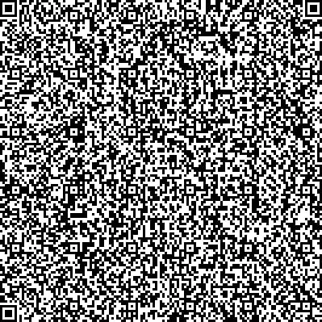

I was hoping to encode the <abbr title="Base 64">b64</abbr> string of a <abbr title="Quick Response">QR</abbr> code into another QR code. The catch was that the encoded QR code would match the encoded string of the QR code. When you scan the QR code, it would return itself.

Sadly, this is most likely [impossible](https://stackoverflow.com/q/5536323), though I might still try to create a search function for it. Instead, I optimized Alok's [approach](https://www.quaxio.com/qrquine) a bit with Javascript's arrow syntax. Minor things like that enabled me to create an HTML-validated QR quine.

```javascript
data:text/html,<!DOCTYPE html><html lang=en><head><title>q</title><canvas id=C><script>P=(r,c,v)=>{I[A*r+c]=v;return!(v&&C.getContext('2d').fillRect(c*3,r*3,3,3))};S=(i,j)=>{for(r=O;r<8;r++)for(c=O;c<8;c++)j+c>O&&j+c<A&&P(i+r,j+c,0<r&&(r<7&&!(c%6))||((c+1)%8&&!(r%6)||1<r&&(r<5&&(1<c&&c<5))))};N=(a,b)=>{if(a[L]<b[L])return a;o=a[0]/b[0];for(i=0;i<b[L];a[i++]^=z){m=b[i];n=o;for(z=0;m;n>255&&(n^=285))m&1&&(z^=n),n<<=1,m>>=1}a.shift();return N(a,b)};C.height=C.width=(A=133)*3;I=[];X=O=-1;L='length';S(0,0);S(A-7,0);S(i=0,A-7);for(B=[6,30,54,78,102,126];i<6;i++)for(j=0;j<6;j++)if(!I[A*B[i]+B[j]])for(r=-2;r<3;r++)for(c=-2;c<3;c++)P(B[i]+r,B[j]+c,r&&!(r%2)||c&&!(c%2)||!r&&!c);for(i=8;i<A-8;P(6,i++,j))j=!(i%2),P(i,6,j);for(i=0;i<15;i++)j=29427>>i&1,i<6&&P(i,8,j)||i<8&&P(i+1,8,j)||P(118+i,8,j),i<8&&P(8,A-i-1,j)||i<9&&P(8,15-i,j)||P(8,14-i,j);P(A-8,8,1);for(i=0;i<18;P(i%3+A-11,i++/3|0,k))k=119615>>i&1,P(i/3|0,i%3+A-11,k);for(D=[4,i=0,6,0,6];i<1542;D=D.concat([j>>4,j&15]))j=unescape(location.href).charCodeAt(i++);D.push(r=0);for(E=3262;D[L]<E;D=D.concat([1,1]))D=D.concat([14,12]);F=[];for(Z=k=r=0;r<14;r++){i=116+(r>6);l=[];for(j=0;j<i;F[r+j*14-(j>115?7:0)]=l[j++])l[j]=(D[k++]<<4)|D[k++];l=l.concat(new Array(30));for(j=0;j<30;j++)F[r+j*14+1631]=N(l,[1,212,246,77,73,195,192,75,98,5,70,103,177,22,217,138,51,181,246,72,25,18,46,228,74,216,195,11,106,130,150])[j]}Y=7;for(x=i=A-1;i>0;i-=2){for(i==6&&i--;x>O&&x<A;x+=X)for(j=0;j<2;j++)if(I[A*x+i-j]==B[9])k=Z<F[L]&&F[Z]>>Y&1,P(x,i-j,x%2?k:!k),--Y<0&&(Z++,Y=7);x-=X;X=-X}</script></canvas>
```



When this text is pasted into a browser's URL, it loads a QR code containing the same link. Here, a QR code is generated, but this is just a little better than having a QR code link to itself.

<iframe class="container" width="100%" frameborder="0" src="https://replit.com/@splch/qr-quine?lite=1"></iframe>
